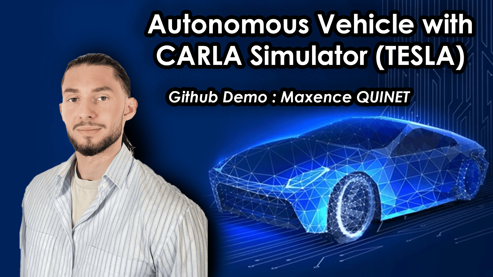

<h1 align="center">
🚗 Autonomous Vehicle & Connected with CARLA Simulator (TESLA) 🧠
</h1>

  
  
  

📌 **Welcome to an end-to-end self-driving car project built with CARLA Simulator!**  
This repository implements **Control, Planning, and Perception modules** for an autonomous vehicle tested in a realistic simulation environment, using CARLA Simulator, the official TESLA Simulator software.  

🔥 **Why this project?**  
Autonomous driving requires the combination of **AI, path planning, and real-time control**.  
All of these components can be **difficult to follow**. This repository **bridges the gap** by providing :
✔ **Tutorial & Theorical Explaination Notebook Files** 📝 
✔ **PID-based Control module** ⚙  
✔ **Path Planning with Dijkstra & A*** 🗺  
✔ **Object Detection (YOLO & CNN) and Fine-Tuning** 🧠  
✔ **Custom Agent reacting to obstacles & traffic lights** 🚦  

---

## 📚 Table of Contents  
- [🚀 Overview](#-overview)  
- [🛠 Technologies](#-technologies)  
- [⚙ Modules Implemented](#-modules-implemented)  
  - [Control](#control-module)  
  - [Planning](#planning-module)  
  - [Perception](#perception-module)  
- [🏃 Getting Started](#-getting-started)  
- [📜 Credits](#-credits)  
- [🎥 Demo](#-demo)  

---

## 🚀 Overview  
This project provides a **theoretical, explanatory, and practical implementation** of the three core modules of autonomous driving: **Perception, Planning, and Control**.  
It includes a **full integration with the CARLA Simulator**, developed as part of a **realistic training program in Connected & Autonomous Vehicles**.  
An autonomous & connected car can:  
- **Perceive** its environment using object detection.  
- **Plan** optimal routes using HD maps.  
- **Control** throttle, braking, and steering with PID algorithms.  

---

## 🛠 Technologies  
- **Simulator**: [CARLA](https://carla.org/)  
- **Language**: Python 3.10.4
- **Machine Learning**: YOLO, CNN, MLP  
- **Algorithms**: PID, Dijkstra, A*  
- **Tools**: Jupyter Notebook, Conda, CUDA, CudNN
- **Libraries**: Numpy, PyGame, carla, shapely, networkx, pandas, opencv-pyhton, ultralytics, torch, torchvision, torchaudio.  

---

## ⚙ Modules Implemented  

### **Control Module**  
- Implements a **PID controller** for longitudinal and lateral control.  
- Converts trajectory and speed limits into steering, throttle, and brake commands.  

### **Planning Module**  
- Global route planning using **Dijkstra** and **A*** algorithms.  
- Computes optimal paths on HD maps.  

### **Perception Module**  
- Object detection with **YOLO** and custom CNN models.  
- Detects traffic lights and obstacles in real-time.  
- Integrates a **Custom Agent** that reacts based on detections.  

---

## 🏃 Getting Started  

### **0. Install CARLA Simulator**  

[CARLA Open Source](https://carla.org/)  

You can install Carla using the repository, by using:
- Git: https://github.com/carla-simulator/carla
- By downloading the files directly : https://github.com/carla-simulator/carla/releases

In order to use the library in your code, move the /Modules folder which you will receive
into the /PythonAPI folder of your CARLA installation.

*Note:* *If you want to use CARLA in the Cloud, please follow the PDF "Setting up Cloud Environment"* 

### **1. Clone the Repository**  
```bash
git clone https://github.com/Quinet-Maxence/carla-autonomous-vehicle.git
```

### **2. Create the Environment**
```bash
conda create -n carla python=3.10.4
conda activate carla
pip install -r requirements.txt
```
**OR :**
```bash
pip install numpy==1.26.4
pip install pygame==2.5.2
pip install carla==0.9.15
pip install shapely==2.0.4
pip install networkx==3.3
pip install pandas==2.2.2
pip install opencv-python==4.10.0.84
pip install ultralytics==8.3.14 torch==2.4.1 torchvision torchaudio
```

### **3. Run the Simulation**
```bash
python manual_control.py --host <remote-host-ip>
python Simulation_Control.py
python Simulation_Perception.py -m <path-to-model> -a Custom
```

## 📜 Credits
- **Author** : Maxence QUINET & Raphaël Frank
- **Simulator**: [CARLA Open Source](https://carla.org/)  

## 🎥 Demo (Click on the Thumbnail)
<p align="center">
  <a href="https://youtu.be/fjoUUs86btM">
    
  </a>
</p>

